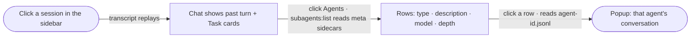
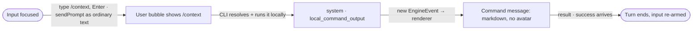
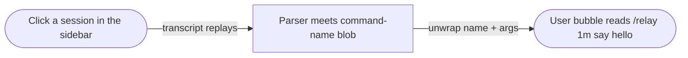
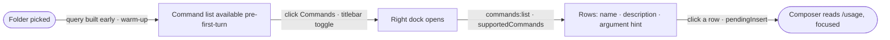
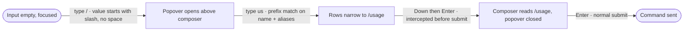
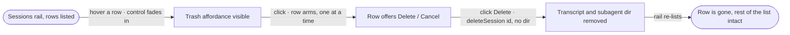

# Happy Paths (MVD)

## One chat turn, folder to answer
- **Idea:** Electron glassy chat UI over Claude Agent SDK — a Claude Code session without the terminal.  **Mode:** ux+beat  **Actor:** the developer (app owner)  **Goal:** ask Claude Code something about a project and read the finished answer, approving one tool call on the way
- **Updated:** 2026-07-22

```mermaid
flowchart LR
  launch([Glassy shell opens]) -->|click Pick folder · native dialog| folder[Folder chosen]
  folder -->|shown as session header · cwd set for SDK| chat[Empty chat + input]
  chat -->|type prompt, Enter · IPC → main: sdk query starts| streaming[Assistant bubble grows]
  streaming -->|SDK emits tool_use · IPC → renderer| toolcard[Tool card appears]
  toolcard -->|click Allow · canUseTool resolves| toolrun[Card shows tool result]
  toolrun -->|SDK streams final text| answer[Finished markdown answer]
  answer -->|turn ends · input re-armed| done([Ready for next prompt])
```

Assumption noted, not drawn: Stop button exists in the core UI but interrupts a turn — it is an exit ramp, not part of the success spine.

## Watch agents work live (PRD A)
- **Idea:** a right-dock Agents panel — list ⇄ map — showing every subagent this session spawned, live.  **Mode:** ux+beat  **Actor:** the developer, mid-turn  **Goal:** see what each agent is doing and read one agent's full transcript without leaving the chat
- **Updated:** 2026-07-25

```mermaid
flowchart LR
  turn([Turn running, Task card visible]) -->|click Agents · titlebar toggle| dock[Right dock opens, list mode]
  dock -->|task_started · row per agent| rows[Rows: type · description · running]
  rows -->|task_progress · every tick| live[Tokens · tool_uses · elapsed · last tool]
  live -->|click Map| map[SVG fan: session node → agent nodes]
  map -->|click a node · subagents:transcript| drawer[Popup: that agent's conversation]
  drawer -->|Esc · task_updated completed| settled([Dock shows finished agents, chat still visible])
```

Assumptions noted, not drawn: the spike that proves this CLI build emits `task_*` messages runs before any of this; nested agents indent via `parentAgentId` but nesting is 1-in-185 in practice, so the common map is a flat fan.

## Review a past session's agents (PRD A)
- **Idea:** the same panel, hydrated from disk, for a session opened out of the sidebar.  **Mode:** ux+beat  **Actor:** the developer, no turn running  **Goal:** reopen yesterday's session and read what its agents did
- **Updated:** 2026-07-25

Assumption noted, not drawn: disk rows carry no token numbers — usage lives only in live `task_progress`.

## Send a screenshot and a file (PRD B)
- **Idea:** paste an image, attach a file, ask about both in one prompt.  **Mode:** ux+beat  **Actor:** the developer at the input bar  **Goal:** get an answer that accounts for a screenshot and a project file
- **Updated:** 2026-07-25

```mermaid
flowchart LR
  input([Input focused]) -->|Ctrl+V image · size + type checked| thumb[Thumbnail chip in tray]
  thumb -->|click paperclip · dialog.showOpenDialog| picked[File chips, by absolute path]
  picked -->|type question, Enter · sendPrompt text + attachments| sent[User bubble with thumbnails]
  sent -->|image block in MessageParam · paths in text| model[Model sees image, Reads the file]
  model -->|answer streams| answer([Reply covering both])
```

Assumption noted, not drawn: on replay the same bubble shows `📎 image/png` chips, not thumbnails — the parser drops `source.data`.

## Run a slash command (PRD C, ticket A)
- **Idea:** type `/context`, see its answer — the CLI already runs it, the wrapper just has to render what comes back.  **Mode:** ux+beat  **Actor:** the developer at the input bar  **Goal:** read the output of a local command without leaving the chat
- **Updated:** 2026-07-27

Assumptions noted, not drawn: the wrapper never parses the leading `/` — resolution, aliases and unknown-command text all stay the CLI's job; `informational` banners ride the existing notice role; the live stream shape is confirmed by a spike before any branch is written.

## Reopen a session that used one (PRD C, blob fix)
- **Idea:** a past `/relay` invocation reads as a command, not as raw XML.  **Mode:** ux+beat  **Actor:** the developer, no turn running  **Goal:** reopen a session and recognise what was typed
- **Updated:** 2026-07-27

Assumption noted, not drawn: the command's *output* stays live-only this ticket — persisted `local_command` stdout is frequently empty, so replaying it is deferred until A shows which commands carry substance.

## Discover what's available (PRD C, ticket B)
- **Idea:** a right dock listing every command this session knows, straight from the CLI.  **Mode:** ux+beat  **Actor:** the developer, fresh app, nothing sent yet  **Goal:** find out a command exists and get it into the composer
- **Updated:** 2026-07-27

Assumptions noted, not drawn: opening this dock closes the Agents dock; the list is fetched fresh per open and never cached, because `supportedCommands()` tracks the CLI's own pushes.

## Complete a command as you type (PRD C, ticket C)
- **Idea:** `/` opens a filtered popover above the composer; Enter accepts the highlighted name.  **Mode:** ux+beat  **Actor:** the developer who half-remembers the name  **Goal:** get to `/usage ` in three keystrokes
- **Updated:** 2026-07-27

Assumptions noted, not drawn: accepting inserts text and never sends — the send stays the user's own keystroke; the composer stays single-line, with multiline still deferred.

## Make the window your own (PRD D, Appearance)
- **Idea:** a third right dock holding the three appearance preferences — theme, backdrop, zoom — each committing the moment it is touched.  **Mode:** ux+beat  **Actor:** the developer, project open, no turn running  **Goal:** re-hue the app, steady the glass, and set a text size that sticks
- **Updated:** 2026-07-31

```mermaid
flowchart LR
  open([Project open, chat visible]) -->|click Appearance · titlebar toggle| dock[Right dock opens, three controls]
  dock -->|click Ember · data-theme on documentElement| themed[Whole window re-hues, live]
  themed -->|click Mica · IPC → setBackgroundMaterial| steady[Backdrop stops flattening on blur]
  steady -->|click + · nextZoom → webContents| sized[Text steps up, readout follows]
  sized -->|close dock · every value already persisted| done([Reopen the app: all three survive])
```

Assumptions noted, not drawn: each control commits on change — there is no Save, because the dock closes itself on a workspace switch and a Save button behind a self-closing panel is a data-loss bug; theme and zoom are renderer-only while backdrop is the one value that crosses IPC; Mica is persistent but wallpaper-tinted, so it is not the blur-behind that Acrylic gives.

## Delete a session you're done with (PRD D, delete)
- **Idea:** a hover-revealed control on the session row that removes the transcript from the store for good.  **Mode:** ux+beat  **Actor:** the developer looking at the sessions rail  **Goal:** get a finished or junk conversation out of the list permanently
- **Updated:** 2026-07-31

Assumptions noted, not drawn: `dir` is deliberately omitted so the SDK enumerates rather than encodes a directory name; deleting the session you are *in* is allowed and drops the pane to a new chat; there is no trash and no undo, which is the whole reason for the second click.
